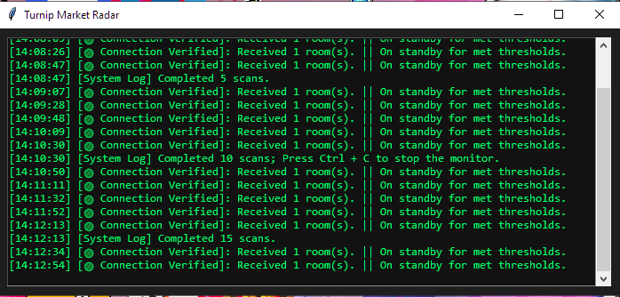
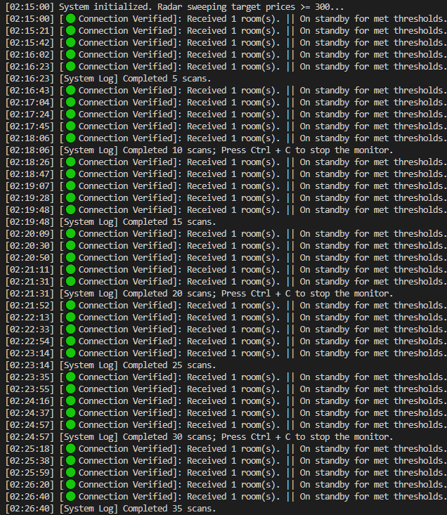

# Turnips.Exchange Discord Notifier

An unofficial Python notifier utility that polls Turnips.Exchange at a configurable interval and pushes real-time matching market spike alerts to an external Discord webhook channel. It features a responsive Tkinter-based live console monitor or a fully headless system mode for background loops.

> **Safety Notice:** This project is unofficial and is intended for respectful, low-frequency polling!

---

## 🛠️ Key Features
- **Dual Runtime Profiles:** Seamlessly toggles between an elegant, low-profile Tkinter GUI log stream and a silent Headless terminal background process.
- **Dynamic Data Cleaning:** Native rule parameters auto-filter dummy platform heartbeats, track unique seen indices to avoid repeating alert notifications, and strip monetization streams (e.g., Twitch, YouTube, Treasure islands).
- **Graceful Error Recovery:** Built-in network connection handlers preserve long-term session health across spotty Wi-Fi connections or server-side dropouts without crashing execution flows.

---

## ⚙️ Architecture Setup

1. **Clone the Repository:**
   ```bash
   git clone https://github.com/sgt-ahab/turnip-exchange-webhook.git
   cd turnip-exchange-webhook
   ```
2. **Install Core Network Dependencies:**
    ```bash
    pip install -r requirements.txt
    ```
3. **Externalize Configuration Rules:**
    ```bash
    cp config.example.json config.json
    ```
    Open `config.json` in your file editor and input your custom target rules:
    - `webhook_url`: Insert your private target Discord text channel webhook URL.
    - `target_min_price`: Minimum base bell price targeted for dispatch (**Default:** `300`).
    - `poll_interval_seconds`: Clock frequency between network queries.
        - *Public Default*: `40` seconds.
        - *Minimum Safe Interval* `20` seconds (Do not drop below this to guarantee network integrity).
    - `headless`: Set to `true` for a pure console-only logging loop or `false` to mount the taskbar monitor window (**Default**: `false`).
    - `user_agent`: Fill this out with a reliable browser string to authenticate connections.
    - `category`: The item segment targeted on the exchange marketplace platform, specifics are: `"turnips"`, `"cataloging"`, `"crafting"`, and `"other"` (**Default:** `"turnips"`).
    - `islander`: Restricts search targeting to specific NPCs: `"daisy"`,`"celeste"`, and `"neither"` (**Default:** `"daisy"`).
    - `allow_count`: Counts the scans, every five displays count, and 10 reminds how to exit with count. Toggled by `true|false` (**Default**: `true`).
    - `save_log`: If `true` then text appends system log entries to a local `session_log.txt`, otherwise `false` disables file logging (**Default**: `false`).

4. **Verify Application Assets:** Ensure that the `assets/` directory remains in the same root folder as your executable script to guarantee the interface successfully loads custom branding elements like the window icon! <br>
###### (Because what is a Daisy Mae radar without Daisy Mae?)
---

## 🚀 Execution Guide

### Desktop GUI Mode(`headless: false`)
To execute the engine as a standalone utility independent of a code terminal workspace, launch the script directly using Python's windowed launcher extension:
```bash
pythonw main.pyw
```
This spawns a compact 700x300 dark mode dashboard directly on your desktop taskbar. It appends precise system timestamps to every connection handshake line, so you can visually verify script persistence while writing code or working on separate workflows.
<br><br>


---
### Headless Terminal Mode(`headless: true`)
For server arrays or minimalist terminal processes:
```bash
python main.pyw
```
*To safely break the system loop and shut down execution monitors in terminal mode, send a clear interrupt sequence to the active terminal (Ctrl + C).*



###### Complete headless can be accomplished with `headless:true` & `pythonw main.pyw`
---

## ☕ Support

If this radar utility saved you hours of browser-refreshing or helped you secure a massive haul of Bells, consider supporting its development! 

[Support on Buy Me a Coffee!](https://buymeacoffee.com/sgtahab)
